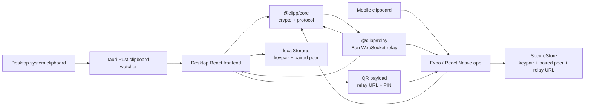
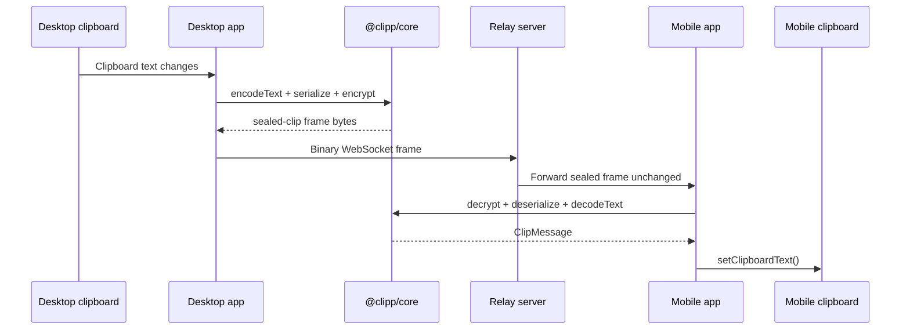

# clipp

## 1. Project overview

`clipp` is an early-stage, pnpm-managed monorepo for a cross-device clipboard sync system that pairs a desktop app with a mobile app and relays encrypted clipboard updates between them in near real time. It is aimed at people who routinely move text between a laptop and a phone and want the relay service to stay blind to clipboard contents by using end-to-end encryption in the shared `@clipp/core` package.

- End-to-end encrypted clipboard sync built on `tweetnacl` sealed boxes.
- Shared protocol and crypto primitives across desktop, mobile, and relay packages.
- QR-based pairing flow that lets the desktop advertise relay URL and PIN to the phone.
- Thin Bun WebSocket relay that forwards binary frames without decrypting payloads.
- Monorepo layout that keeps platform-specific code isolated while sharing protocol logic.


## 2. Table of contents

- [1. Project overview](#1-project-overview)
- [2. Table of contents](#2-table-of-contents)
- [3. High-level architecture](#3-high-level-architecture)
- [4. Repository structure](#4-repository-structure)
- [5. Core functionality](#5-core-functionality)
- [6. Data pipelines & data flow](#6-data-pipelines--data-flow)
- [7. API & interface reference](#7-api--interface-reference)
- [8. Configuration & environment variables](#8-configuration--environment-variables)
- [9. Local development setup](#9-local-development-setup)
- [10. Testing strategy](#10-testing-strategy)
- [11. DevSecOps pipeline](#11-devsecops-pipeline)
- [12. Infrastructure & IaC](#12-infrastructure--iac)
- [13. Observability](#13-observability)
- [14. Security & compliance](#14-security--compliance)
- [15. Contributing](#15-contributing)
- [16. Changelog & versioning](#16-changelog--versioning)
- [17. License](#17-license)

## 3. High-level architecture

`clipp` is an event-driven, client-heavy system with a thin relay in the middle. The desktop and mobile clients each watch their local clipboard, transform clipboard text into a typed `ClipMessage`, encrypt that message with the peer's public key, and send only binary relay frames over WebSocket. The relay is intentionally stateless with respect to plaintext; it only tracks pairing state and in-memory room membership so it can forward encrypted blobs to the paired peer.



### Layer mapping

| Layer | Directories | Notes |
| --- | --- | --- |
| Presentation | `packages/desktop/src`, `packages/mobile/src` | React UI for desktop and React Native UI for mobile. |
| Platform integration | `packages/desktop/src-tauri/src`, `packages/mobile/src/hooks/useClipboard.ts` | Tauri clipboard commands and Expo clipboard polling. |
| Business logic | `packages/core/src`, `packages/desktop/src/hooks/useSync.ts`, `packages/mobile/src/hooks/useSync.ts`, `packages/relay/src` | Pairing, session resume, serialization, encryption, relay routing. |
| Runtime / infra glue | `packages/relay/src/index.ts`, `packages/desktop/src-tauri/tauri.conf.json`, `packages/mobile/scripts/expo-start.mjs`, root `package.json` | Bun server bootstrap, Tauri config, Expo startup wrapper, workspace scripts. |
| Persistence | browser `localStorage`, Expo `SecureStore`, relay in-memory `Map`s, host system clipboard | No database or durable server-side store is present. |

### External systems and services

- Bun runtime for the relay server via `Bun.serve()`.
- WebSocket transport between desktop, mobile, and relay.
- Host system clipboard via the Rust `arboard` crate on desktop.
- Expo clipboard APIs on mobile via `expo-clipboard`.
- Expo camera APIs for QR scanning via `expo-camera`.
- Expo SecureStore for mobile key and session persistence.
- Tauri v2 runtime and native bridge for the desktop app.
- UDP connect to `8.8.8.8:80` on desktop to infer a shareable LAN IP for the relay URL.

## 4. Repository structure

```text
clipp/
├── .gitignore                  # Ignore JS build output and Rust target artifacts
├── .npmrc                      # Forces pnpm hoisted linker mode
├── package.json                # Workspace root manifest and convenience scripts
├── pnpm-workspace.yaml         # pnpm workspace package discovery
├── tsconfig.base.json          # Shared TypeScript compiler defaults
├── packages/
│   ├── core/
│   │   ├── package.json        # Shared protocol/crypto package manifest
│   │   ├── tsconfig.json       # Core package TS build config
│   │   └── src/                # Shared types, crypto helpers, binary protocol
│   ├── relay/
│   │   ├── package.json        # Bun-based relay package manifest
│   │   ├── tsconfig.json       # Relay TS build config
│   │   └── src/                # Pairing manager, router, relay server bootstrap
│   ├── desktop/
│   │   ├── package.json        # Vite + Tauri desktop package manifest
│   │   ├── vite.config.ts      # Vite React config with explicit React aliases
│   │   ├── src/                # Desktop React UI and sync hooks
│   │   └── src-tauri/          # Rust backend, Tauri config, generated schemas
│   └── mobile/
│       ├── package.json        # Expo app manifest and scripts
│       ├── app.json            # Expo app configuration
│       ├── metro.config.js     # Expo Metro workspace resolution tweaks
│       ├── index.js            # Expo entrypoint that loads polyfills first
│       ├── scripts/            # Expo CLI wrapper script
│       └── src/                # React Native screens, hooks, and polyfills
└── pnpm-lock.yaml              # Locked dependency graph for the workspace
```

### Significant files

- `packages/core/src/crypto.ts`: key generation, `nacl.box` encrypt/decrypt, base64/hex helpers, PIN generation.
- `packages/core/src/protocol.ts`: binary serializer/deserializer for clip messages and relay frames.
- `packages/relay/src/server.ts`: relay frame handling, pairing, resume, and forwarding logic.
- `packages/desktop/src/App.tsx`: QR-first desktop pairing UI plus clipboard/history display.
- `packages/desktop/src-tauri/src/clipboard.rs`: native clipboard read/write plus 500 ms polling loop.
- `packages/mobile/src/App.tsx`: mobile app state machine for pairing, reconnect, and home screen selection.
- `packages/mobile/src/polyfills.ts`: `TextEncoder`/`TextDecoder` and random-value polyfills required for Expo/Hermes compatibility.

## 5. Core functionality

### `@clipp/core`

What it does:
- Defines the shared domain model for clip payloads, devices, and relay frames.
- Implements all cross-platform serialization and cryptography.

Implemented in:
- `packages/core/src/types.ts`
- `packages/core/src/crypto.ts`
- `packages/core/src/protocol.ts`
- `packages/core/src/index.ts`

Design choices:
- Uses `tweetnacl` public-key authenticated encryption via `nacl.box`.
- Uses a custom binary protocol instead of JSON on the WebSocket wire.
- Derives human-readable device IDs from the first 8 bytes of the public key.

Visible limitations:
- `ClipMessage.type` supports `"image"`, but the current clients only send and render text.
- No protocol negotiation beyond a hard-coded `PROTOCOL_VERSION = 1`.

### `@clipp/relay`

What it does:
- Accepts binary WebSocket frames, handles pairing, keeps in-memory room membership, and forwards sealed clips between paired devices.

Implemented in:
- `packages/relay/src/index.ts`
- `packages/relay/src/pairing.ts`
- `packages/relay/src/router.ts`
- `packages/relay/src/server.ts`

Design choices:
- Bun-first implementation with an explicit note in code that it can be ported to Node `ws`.
- `PairingManager` keeps pending PIN requests with a 10-minute TTL.
- `MessageRouter` separates room membership from pending pairing state and supports reconnect/resume by `deviceId`.

Visible limitations:
- All relay state is in memory. Restarting the relay drops active rooms and pending pairing requests.
- There is no HTTP health endpoint or admin API.
- No authentication beyond possession of the PIN during pairing and possession of device keys for decrypting clips.

### Desktop app (`@clipp/desktop`)

What it does:
- Watches the desktop clipboard, emits clipboard changes from Rust into the Tauri frontend, maintains a relay connection, and displays a QR code that encodes the phone-facing relay URL and current pairing PIN.

Implemented in:
- Frontend: `packages/desktop/src/App.tsx`, `packages/desktop/src/hooks/useClipboard.ts`, `packages/desktop/src/hooks/useSync.ts`
- Native backend: `packages/desktop/src-tauri/src/main.rs`, `packages/desktop/src-tauri/src/commands.rs`, `packages/desktop/src-tauri/src/clipboard.rs`

Design choices:
- Native clipboard access is handled in Rust via `arboard`.
- The QR onboarding flow is automatic: once connected to the relay and still unpaired, the desktop sends a `pair-request` and advertises the relay URL and PIN via QR.
- Clipboard history is kept client-side and capped at 20 entries.

Visible limitations:
- Long-lived desktop keys and paired-peer metadata are stored in browser `localStorage`, not an OS keychain.
- Clipboard watching is polling-based every 500 ms rather than event-hook based.
- The relay URL is hard-coded in the frontend as `ws://127.0.0.1:8787` for the desktop's own connection.

### Mobile app (`@clipp/mobile`)

What it does:
- Polls the mobile clipboard, scans the desktop QR code, persists its keypair and paired peer, and reconnects to the relay when the app returns to the foreground.

Implemented in:
- `packages/mobile/index.js`
- `packages/mobile/src/App.tsx`
- `packages/mobile/src/hooks/useClipboard.ts`
- `packages/mobile/src/hooks/useSync.ts`
- `packages/mobile/src/screens/HomeScreen.tsx`
- `packages/mobile/src/screens/PairingScreen.tsx`
- `packages/mobile/src/polyfills.ts`

Design choices:
- Uses `expo-secure-store` for mobile key/session storage.
- Loads polyfills before the app entrypoint so Hermes has `TextEncoder`/`TextDecoder` and secure random values available for `tweetnacl`.
- Uses `expo-camera` QR scanning rather than manual relay/PIN entry.

Visible limitations:
- Clipboard syncing is foreground-app based; there is no background task, service, or IME integration.
- Mobile clipboard watching is also polling-based every 500 ms.
- The Expo startup wrapper disables Expo dependency validation, which is practical for this workspace but worth noting for future cleanup.

## 6. Data pipelines & data flow

### Pipeline inventory

| Pipeline | Source | Transformations | Sink | Trigger |
| --- | --- | --- | --- | --- |
| Desktop clipboard ingestion | OS clipboard via `arboard` | Poll every 500 ms, emit `clipboard-changed` event into Tauri frontend | Desktop React state | Background thread loop in `clipboard.rs` |
| Mobile clipboard ingestion | `expo-clipboard` | Poll every 500 ms, update React state | Mobile React state | `setInterval` in `useClipboard.ts` |
| Pairing request flow | Desktop QR + relay socket | Generate PIN, encode QR payload JSON, send `pair-request` frame | Relay pending-pair map, then room state | Manual QR scan plus automatic client actions |
| Session resume | Stored paired peer + stored keypair | Send `resume-session` with current device info | Relay room reattachment | WebSocket reconnect |
| Sealed clip propagation | Local clipboard text | Encode text, wrap in `ClipMessage`, serialize, encrypt, wrap in `sealed-clip` frame | Paired peer clipboard | Clipboard change while paired |

### Critical pipeline: clipboard sync



### Throughput and timing expectations

- Clipboard polling is explicitly every `500 ms` on both desktop and mobile.
- Pair requests expire after `10 minutes`.
- Reconnect attempts are delayed by `1000 ms`.
- No throughput, payload-size, or retention SLA is declared anywhere in code.

### Data stores and access patterns

| Store | Location | Used for | Access pattern | Retention |
| --- | --- | --- | --- | --- |
| System clipboard | Host OS | Current clipboard text | Poll, read, and overwrite | Managed by the OS |
| `localStorage` | Desktop webview storage | Desktop keypair and paired peer metadata | Read on startup, overwrite on pair/resume | Persistent until user clears app storage |
| `SecureStore` | Mobile secure storage | Mobile keypair, paired peer metadata, last relay URL | Read on startup, overwrite on pair/resume | Persistent until deleted or app storage reset |
| Relay `Map`s | Relay process memory | Pending PIN requests, room membership, device-to-room mapping | In-memory read/write on each WebSocket event | Lost on process restart |

### Data contracts

- Binary relay frame contract is defined and enforced in `packages/core/src/types.ts` and `packages/core/src/protocol.ts`.
- `ClipMessage` serialization is enforced by `serialize()` and `deserialize()`.
- QR payloads are JSON objects parsed and validated in `packages/mobile/src/screens/PairingScreen.tsx`.
- No OpenAPI, GraphQL schema, Protobuf, JSON Schema, or Avro definitions are present.

## 7. API & interface reference

There is no REST, GraphQL, or gRPC API in this repository. The public interfaces are:

1. Binary WebSocket relay frames.
2. Tauri commands exposed from the desktop backend to the desktop frontend.
3. QR pairing payloads exchanged out-of-band between desktop and mobile.

### Relay WebSocket interface

Wire protocol notes:
- Transport: WebSocket.
- Payload format: binary only.
- Encoding: custom binary format from `encodeRelayFrame()` / `decodeRelayFrame()`.
- Auth: none at the transport layer.

The table below uses JSON-like examples for readability. Actual on-wire payloads are binary.

| Frame kind | Direction | Auth required | Conceptual shape |
| --- | --- | --- | --- |
| `pair-request` | client -> relay | No | `{ kind, pin, device }` |
| `pair-accept` | client -> relay | No | `{ kind, pin, device }` |
| `pair-complete` | relay -> client | No | `{ kind, roomId, peer }` |
| `resume-session` | client -> relay | No | `{ kind, device }` |
| `sealed-clip` | client -> relay -> peer | No | `{ kind, senderDeviceId, nonce, ciphertext }` |
| `error` | relay -> client | No | `{ kind, code, message }` |
| `room-closed` | relay -> client | No | `{ kind, roomId, message }` |

#### Example conceptual `pair-request`

```json
{
  "kind": "pair-request",
  "pin": "482193",
  "device": {
    "deviceId": "d1e2f3a4b5c6d7e8",
    "name": "Desktop",
    "platform": "desktop",
    "publicKey": "<Uint8Array>"
  }
}
```

#### Example conceptual `sealed-clip`

```json
{
  "kind": "sealed-clip",
  "senderDeviceId": "d1e2f3a4b5c6d7e8",
  "nonce": "<Uint8Array>",
  "ciphertext": "<Uint8Array>"
}
```

#### Relay error codes visible in code

| Code | Meaning |
| --- | --- |
| `invalid-payload` | Non-binary WebSocket frame received |
| `decode-failed` | Binary payload could not be decoded as a relay frame |
| `relay-error` | Pairing or routing logic threw an exception |
| `resume-failed` | No saved room exists for the reconnecting device |
| `not-paired` | No paired peer is available for a `sealed-clip` send |
| `invalid-frame` | Client tried to send a relay-only frame kind |

### Desktop Tauri command interface

| Command | Caller | Request | Response | Errors |
| --- | --- | --- | --- | --- |
| `get_clipboard` | Desktop frontend | none | `string` clipboard text | Propagates native clipboard read errors as `String` |
| `set_clipboard` | Desktop frontend | `{ text: string }` | `void` | Propagates native clipboard write errors as `String` |
| `get_pairing_relay_url` | Desktop frontend | none | `string` like `ws://192.168.1.10:8787` | Returns a stringified error if LAN IP discovery fails |

#### Example `invoke()` calls

```ts
const text = await invoke<string>("get_clipboard");
await invoke("set_clipboard", { text: "hello" });
const relayUrl = await invoke<string>("get_pairing_relay_url");
```

### QR pairing payload

Parsed in `packages/mobile/src/screens/PairingScreen.tsx`.

```json
{
  "relayUrl": "ws://192.168.1.10:8787",
  "pin": "482193",
  "publicKey": "<optional base64 public key>",
  "deviceName": "Desktop"
}
```

Validation rules enforced in code:
- `relayUrl` must be a non-empty string starting with `ws://` or `wss://`.
- `pin` must be a non-empty string.
- `publicKey` and `deviceName` are optional.

No generated Swagger, Redoc, Storybook, or similar interface docs are present.

## 8. Configuration & environment variables

The repository does not include a `.env.example` or any committed environment-specific configuration file. Most runtime settings are hard-coded in the clients. The relay is the only package that currently reads process environment variables directly.

### Relay runtime

| Variable | Required | Default | Description | Example |
| --- | --- | --- | --- | --- |
| `HOST` | Optional | `0.0.0.0` | Relay bind address used by `packages/relay/src/index.ts` | `0.0.0.0` |
| `PORT` | Optional | `8787` | Relay bind port used by `packages/relay/src/index.ts` | `8787` |

### Expo startup wrapper

These are set by `packages/mobile/scripts/expo-start.mjs` rather than documented as user-managed settings.

| Variable | Required | Default | Description | Example |
| --- | --- | --- | --- | --- |
| `EXPO_NO_DEPENDENCY_VALIDATION` | Optional | `1` in script | Disables Expo dependency validation during `expo start` | `1` |

### Hard-coded runtime values

| Setting | Location | Value | Notes |
| --- | --- | --- | --- |
| Desktop relay URL | `packages/desktop/src/App.tsx` | `ws://127.0.0.1:8787` | Desktop app always connects to a local relay process |
| Pair request TTL | `packages/relay/src/pairing.ts` | `10 * 60 * 1000` ms | Pending PINs expire after 10 minutes |
| Reconnect delay | `packages/desktop/src/hooks/useSync.ts`, `packages/mobile/src/hooks/useSync.ts` | `1000` ms | Client reconnect backoff |
| Clipboard poll interval | `packages/desktop/src-tauri/src/clipboard.rs`, `packages/mobile/src/hooks/useClipboard.ts` | `500` ms | Polling cadence on both platforms |

Secrets guidance:
- The repo currently has no environment-managed secrets.
- Device secret keys are generated locally and stored on-device, not committed.
- These values must never be committed if future work moves them into files or environment variables.

## 9. Local development setup

### Prerequisites

- Node.js installed locally. The repo does not pin a specific version, but it must be compatible with `pnpm@9.12.3`, Vite, and Expo SDK 54.
- `pnpm` available on your `PATH`.
- Bun installed for the relay (`packages/relay` uses `bun run`).
- Rust toolchain installed for the Tauri desktop app.
- Tauri v2 native prerequisites for your OS.
- Expo Go on a physical device or an emulator/simulator for mobile testing.

### Install dependencies

From the repository root:

```powershell
pnpm install
```

This workspace uses hoisted pnpm linking in both `.npmrc` and `pnpm-workspace.yaml`.

### Environment bootstrap

- No `.env.example` file is present.
- No seed scripts or fixture loaders are present.
- Mobile and desktop keypairs are generated automatically on first launch.
- The desktop relay URL is fixed in code; the desktop also computes a phone-facing LAN URL at runtime via `get_pairing_relay_url()`.

### Start the system locally

1. Start the relay:

```powershell
pnpm --filter @clipp/relay dev
```

2. Start the desktop app:

```powershell
cd packages/desktop
pnpm tauri:dev
```

3. Start the mobile app:

```powershell
pnpm --filter @clipp/mobile start -- --clear
```

### Pair desktop and mobile

1. Launch the desktop app and wait for the QR code to appear.
2. Open the mobile app and tap the QR scan action.
3. Scan the desktop QR code.
4. Keep the relay process running while you test clipboard sync.

### Available build and type-check commands

Root:

```powershell
pnpm build
```

Package-specific:

```powershell
pnpm --filter @clipp/core build
pnpm --filter @clipp/relay build
pnpm --filter @clipp/desktop build
pnpm --filter @clipp/mobile build
```


